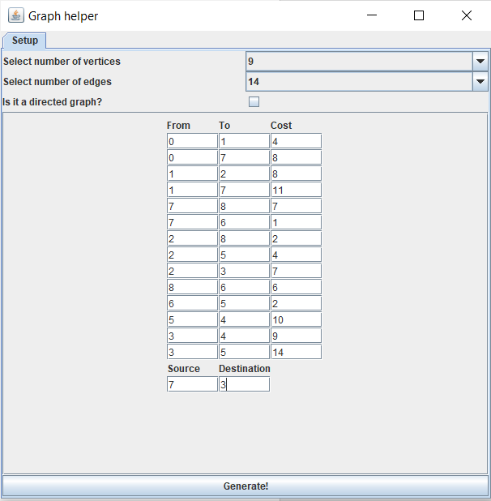
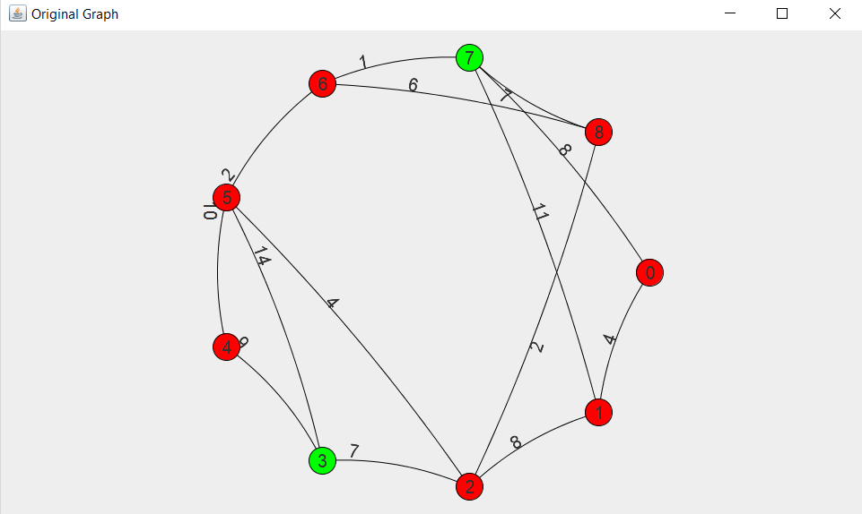
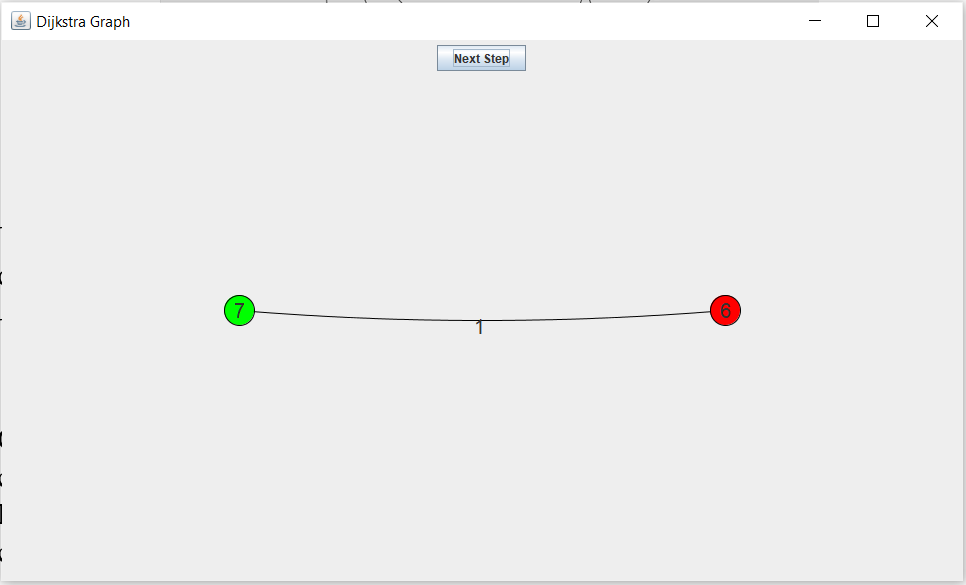
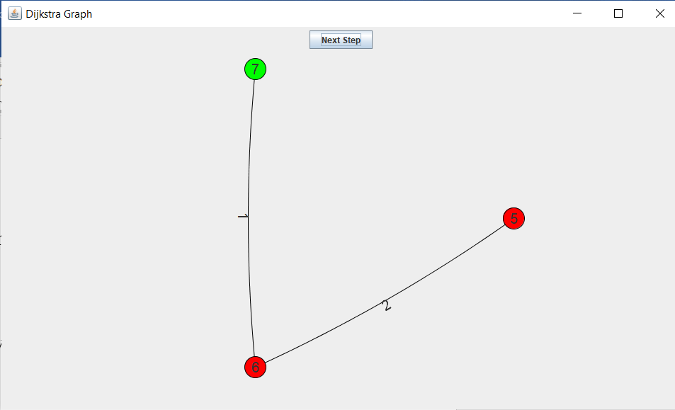
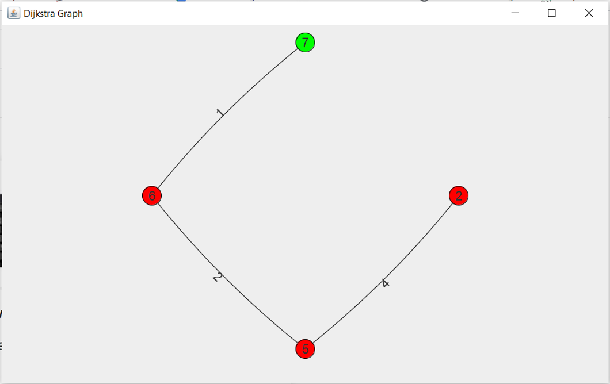
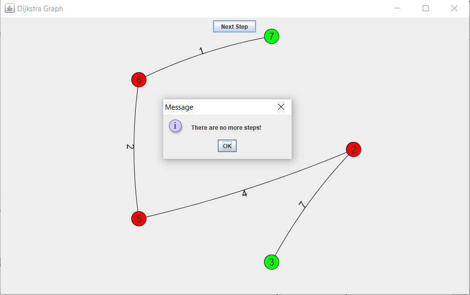

# DijkstraVisualizer
A project that simulates dijkstra algorithm and visualizes that path step by step.

**1) Setup to use this program:**\
     1.1) Download or Clone this repository.
     1.2) Download JUNG library from here -> [JUNG lib.](http://jung.sourceforge.net/download.html)
     1.3) EXtract the jars and add them to the project dependencies.
     
     
**2) Program demonstration:**
     2.1)The first window that appears when the system runs is a tab that allows the user to input the description of the graph. It asks for the number of vertices and edges. It also asks for the source and destination nodes for the Dijkstra algorithm and graph type (directed/undirected).
     \
     
     

   2.2) After clicking generate, two windows containing visualization of the original graph, and another for shortest path from source to destination.
    
    
    2.3) Clicking “Next Step” runs one iteration of Dijkstra and the changes are reflected on the graph, there is also a “cost so far” variable that updates cost with each step, The next is the second iteration of our case
    . 
    
    
    
